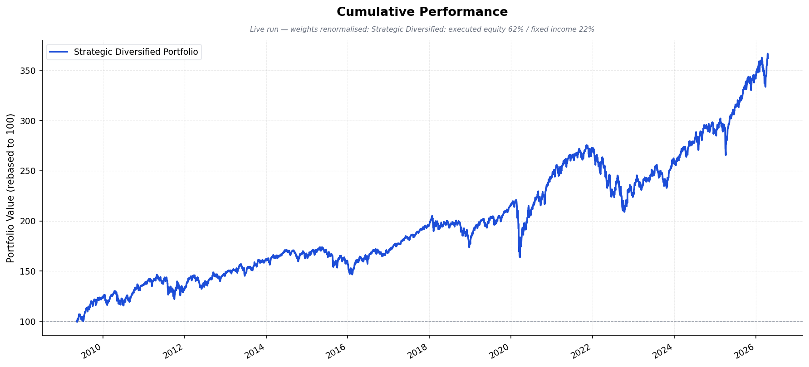
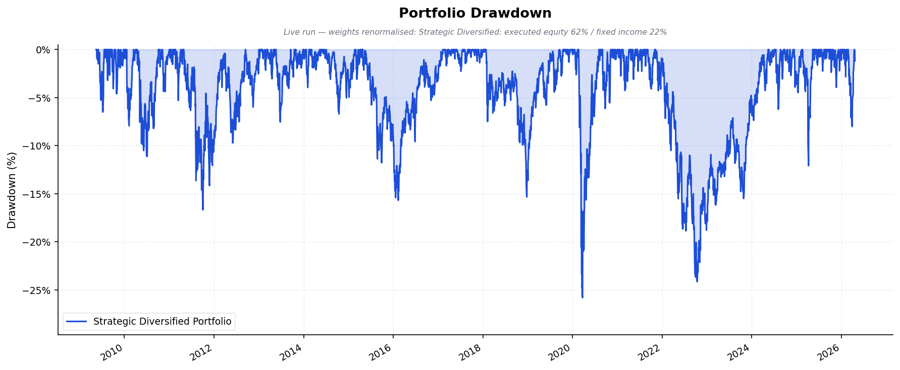
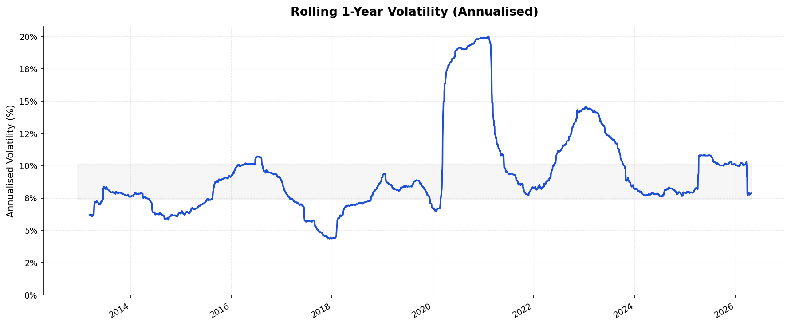
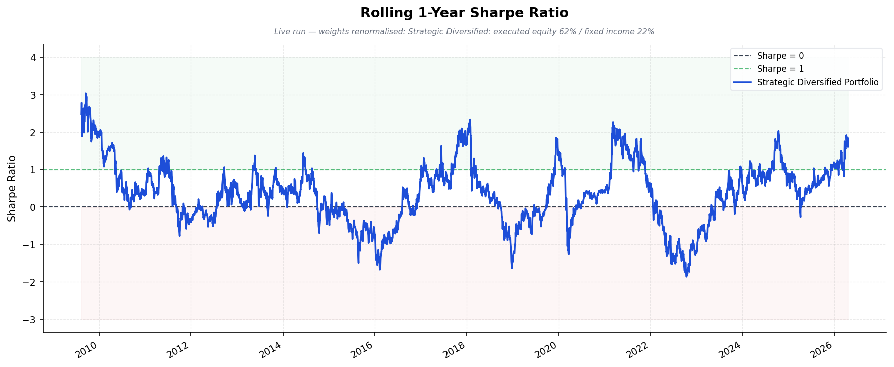
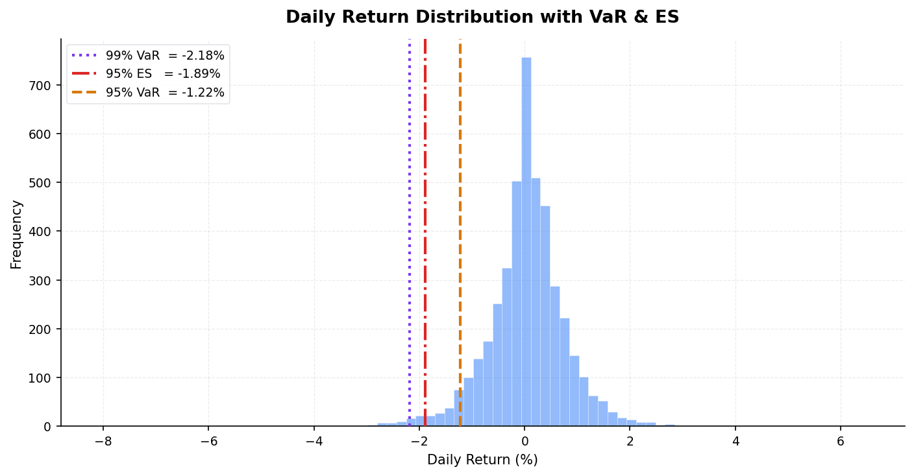
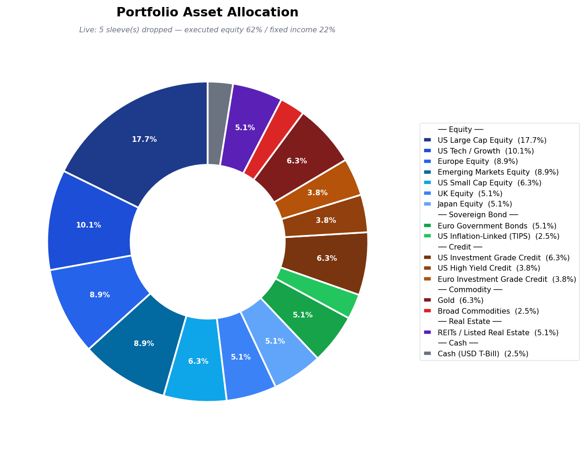
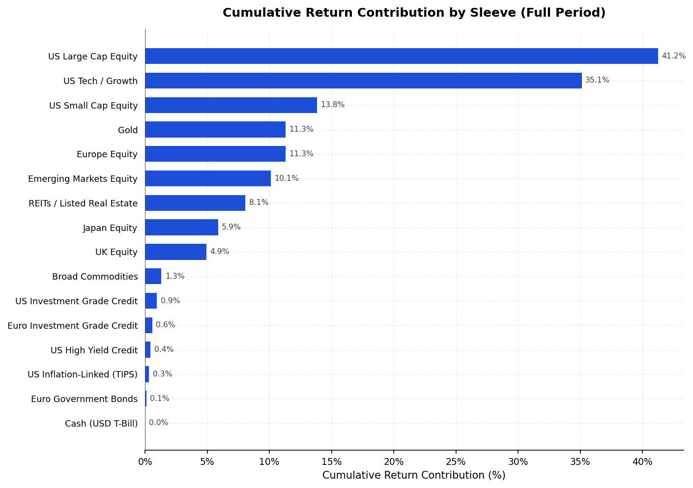
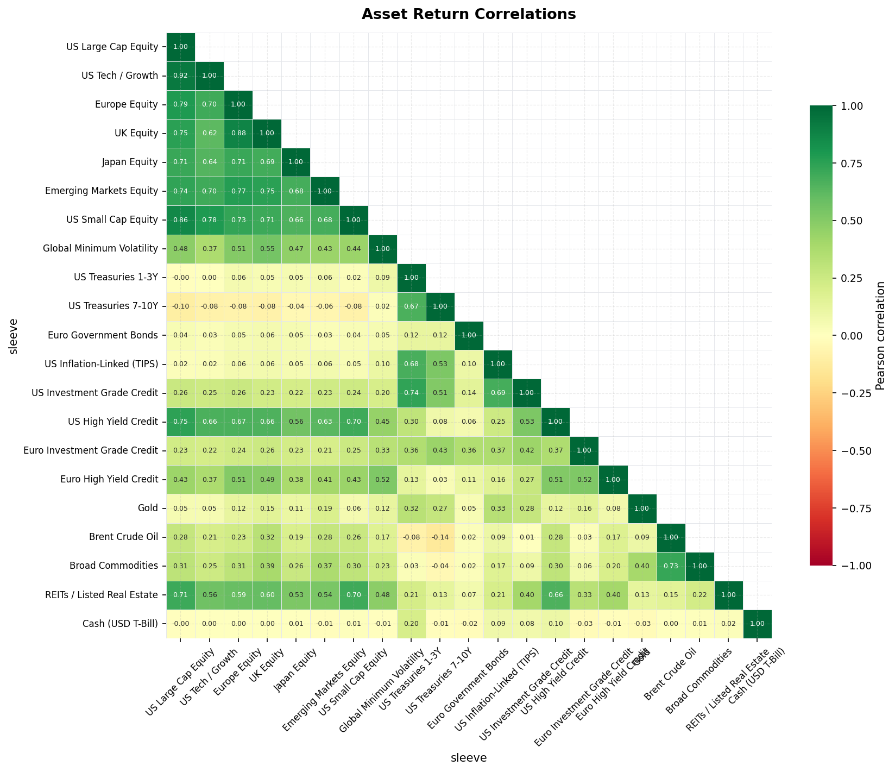
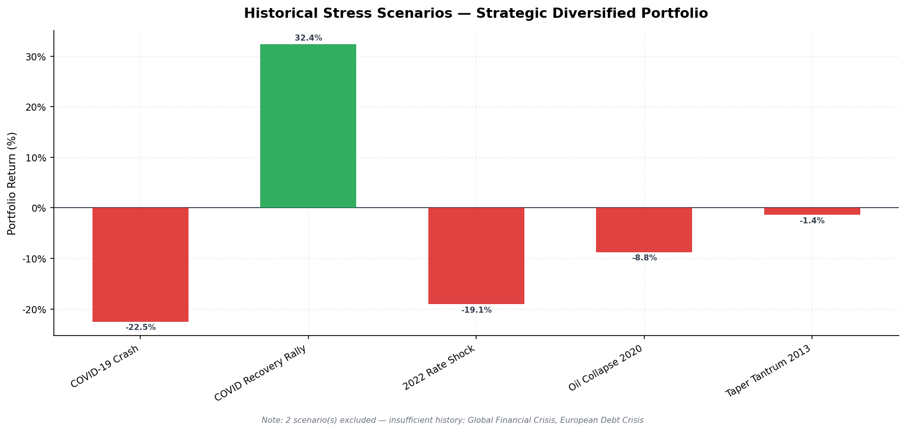
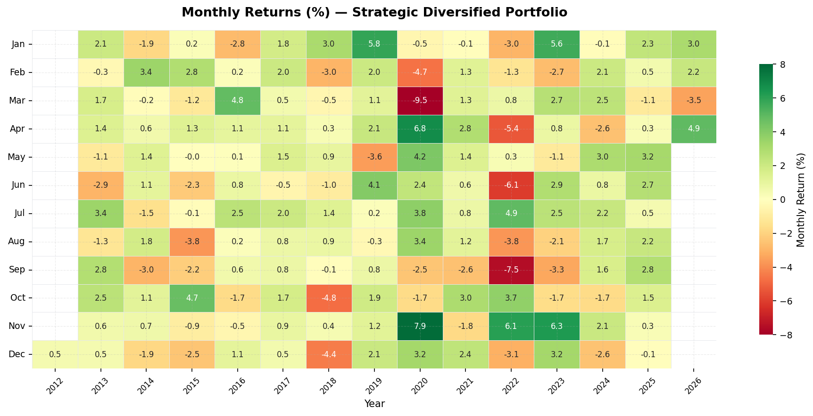

# Desk-Oriented Portfolio Risk Backtesting Engine

A professional Python toolkit for multi-asset portfolio risk monitoring, backtesting, and stress testing — built around LSEG market data with full synthetic-data demo mode.

> **Scope:** This is a **risk monitoring and backtesting engine**, not a live trading system, execution framework, or alpha-generation engine. It is designed for PM support, multi-asset risk review, investment committee preparation, and scenario analysis.

---

## What this toolkit does

It answers the questions a risk analyst or multi-asset PM asks on a regular basis:

> *What is the portfolio actually earning, how much risk is it running, how does it compare to its mandate, and how would it survive a repeat of past crises?*

```
LSEG data  →  cleaning (audited)  →  returns  →  portfolio construction
          →  integrity check (target vs executed)
          →  risk analytics (VaR, ES, drawdowns, rolling metrics)
          →  correlation & concentration analysis
          →  stress testing (historical windows + factor shocks)
          →  contribution & attribution analysis
          →  benchmark-relative metrics (TE, IR, beta)
          →  turnover & cost reporting
          →  exportable tables, charts, tearsheet, run manifest
```

---

## What this toolkit does NOT do

- Live automated trading or order routing
- Broker or OMS connectivity
- Portfolio optimisation (no Black-Litterman, no mean-variance)
- Alpha generation or factor investing
- ESG overlays or sustainability analysis
- Full FX decomposition (FX risk is embedded in non-USD sleeve prices — see [Limitations](#limitations))

---

## Universe: 22 Multi-Asset Sleeves

| # | Sleeve | Primary ETF | Fallback ETF | Asset Class | Live status |
|---|--------|-------------|--------------|-------------|-------------|
| 1 | US Large Cap Equity | SPY | IVV | Equity | primary_ok |
| 2 | US Tech / Growth | VGT | QQQ | Equity | primary_ok ¹ |
| 3 | Europe Equity | EZU | VGK | Equity | primary_ok |
| 4 | UK Equity | EWU | ISF.L | Equity | primary_ok |
| 5 | Japan Equity | EWJ | HEWJ | Equity | primary_ok |
| 6 | Emerging Markets | EEM | VWO | Equity | primary_ok |
| 7 | US Small Cap | IWM | VB | Equity | primary_ok |
| 8 | Global Min Volatility | MVOL.L | XDWD.DE | Equity | primary_ok ² |
| 9 | US Treasuries 1-3Y | BSV | BSV | Sovereign Bond | primary_ok ³ |
| 10 | US Treasuries 7-10Y | SXRL.DE | IS04.DE | Sovereign Bond | primary_ok ⁴ |
| 11 | Euro Government Bonds | IBGE.AS | EXX6.DE | Sovereign Bond | primary_ok |
| 12 | US TIPS (Inflation-Linked) | TIP | SCHP | Sovereign Bond | primary_ok |
| 13 | UK Gilts | IGLT.L | VGOV.L | Sovereign Bond | primary_ok |
| 14 | US Investment Grade Credit | LQD | VCIT | Credit | primary_ok |
| 15 | US High Yield Credit | HYG | JNK | Credit | primary_ok |
| 16 | Euro Investment Grade Credit | IEAC.AS | EXH3.DE | Credit | primary_ok |
| 17 | Euro High Yield Credit | IHYG.L | SHYU.L | Credit | primary_ok ⁵ |
| 18 | Gold | GLD | IAU | Commodity | primary_ok |
| 19 | Brent Crude Oil | BNO | LCOc1 | Commodity | primary_ok |
| 20 | Broad Commodities | DJP | PDBC | Commodity | primary_ok ¹ |
| 21 | REITs / Listed Real Estate | VNQ | IYR | Real Estate | primary_ok |
| 22 | Cash (USD T-Bill) | BIL | SHV | Cash | primary_ok |

¹ VGT / DJP used as primary because QQQ / PDBC return zero rows under this LSEG entitlement.  
² MVOL.L (iShares MSCI World Min Vol, London GBP) replaces unavailable USMV/SPLV. Tracks MSCI World Min Vol — global universe, more faithful to sleeve name than original US-only USMV. GBP currency exposure embedded.  
³ BSV (Vanguard Short-Term Bond) replaces unavailable SHY/VGSH. **Not pure treasury**: ~65% government + ~35% IG corporate blend, duration ~2.8Y. Sleeve performance will reflect minor credit spread sensitivity. **No validated fallback**: SHY, VGSH, SCHO, IEI, SCHR, FLOT, SPTS all failed LIVE testing — fallback_ric is set to BSV (same as primary).  
⁴ SXRL.DE (SPDR Bloomberg 7-10Y US Treasury UCITS ETF, Xetra, EUR) replaces unavailable IEF/VGIT. LIVE-confirmed: 2009-12-01. Tracks Bloomberg US Treasury 7-10 Year Bond Index. **EUR-denominated** — unhedged EUR/USD FX exposure embedded. UCITS product; not US-listed. Fallback: IS04.DE (iShares $ Treasury Bond 7-10yr UCITS ETF, Xetra, EUR), LIVE-confirmed: 2015-01-26. All US-listed alternatives unavailable (IEF, VGIT, ITE, IEI, SCHR, GOVT, TLT, SCHZ). UK/NL-listed UCITS also inaccessible (IBTM.L, IBTM.AS, SXRL.L, VUST.L). VDTY.L works from 2016-02-25 but not promoted due to shorter history.  
⁵ IHYG.L (iShares Euro HY Corp Bond, London GBP) replaces unavailable IHYG.AS/HYB.DE. Tracks same iBoxx EUR High Yield index. SHYU.L (USD-hedged class) set as fallback — preferred if GBP currency purity matters.

Each sleeve has a primary RIC, a fallback RIC, documented LSEG entitlement notes, and inception date. Non-USD sleeves (.AS, .L, .DE) embed unhedged FX risk in their returns relative to a USD base portfolio. All 22 sleeves have LIVE-confirmed working proxies as of 2026-04-24.

---

## Data Source

**Primary:** [LSEG Data Library / Eikon API](https://developers.lseg.com/)

Three backends supported in priority order:
1. `lseg-data` (LSEG Data Library — current)
2. `refinitiv-data` (previous branding, same library)
3. `eikon` (legacy Eikon Python API)

**Entitlement notes:**
- US-listed ETF price series (`TR.PriceClose`) are broadly available under standard LSEG entitlements
- Exchange-suffixed RICs (`.AS`, `.L`) require EU/UK market data entitlements
- `TR.TotalReturn` requires a premium subscription; the toolkit **defaults to price return** and flags this explicitly
- Fallback RICs are attempted automatically when primary fails

---

## If market data is unavailable for some sleeves or dates

### What fallback attempts are made

For each sleeve, the loader attempts in order:
1. **Parquet cache** — reused if fresh (< 1 day old) and covers the requested date range
2. **Primary RIC + preferred field** (`TR.PriceClose` or `CF_CLOSE`)
3. **Fallback RIC + alternate field** — as defined in `config/universe.yaml` per sleeve
4. **Sleeve rejection** — if both attempts fail, the sleeve is flagged as unavailable with an explicit log entry

Before a live run, run `python scripts/validate_universe.py` to probe which sleeves are accessible under your entitlements. For sleeves with both primary and fallback unavailable, run `python scripts/discover_candidates.py` to probe an extended candidate list and promote any working RIC into `config/universe.yaml`.

### Cleaning: pre-inception vs in-sample missingness

The cleaning pipeline distinguishes two categories of missing data:

| Type | Definition | Treatment |
|------|-----------|-----------|
| **Pre-inception** | Leading NaNs before a sleeve's first valid price date | **Not counted** toward the missing threshold. The sleeve has no data yet; this is expected. |
| **In-sample gaps** | NaNs occurring *after* the first valid price | **Counted** toward the 20% missing threshold. These represent genuine data quality issues. |

This prevents sleeves with a later inception date (e.g. BNO / Brent crude, inception 2010) from being wrongly excluded when the global backtest window starts earlier (e.g. 2007). The `data_quality_report.csv` records both `pre_inception_rows` and `in_sample_missing_pct` per sleeve for full auditability.

### How degraded runs are identified

Every run produces:
- `outputs/run_manifest.json` — available/dropped sleeves, data date range, RIC mapping, integrity status
- `outputs/run_warnings.json` — categorised data quality, drop, and outlier warnings
- `outputs/tables/data_quality_report.csv` — per-sleeve cleaning audit (pre-inception rows, in-sample missing %, gap fills, outlier caps)

### Portfolio integrity status

When sleeves are dropped, weights are renormalised. The toolkit quantifies the distortion:

| Status | Condition |
|--------|-----------|
| `VALID` | ≤15% of target weight dropped; all asset classes present |
| `DEGRADED` | >15% dropped, or an asset class is materially reduced |
| `INVALID_PORTFOLIO_CONFIGURATION` | >40% dropped, or fewer than 5 sleeves remain |

Status is reported in:
- `outputs/tables/portfolio_validity_summary.json`
- `outputs/tables/target_vs_executed_weights.csv`
- `outputs/tables/asset_class_drift_report.csv`
- `outputs/tearsheet.md` (header section)
- Time-series charts (subtitle disclosure line in live mode)

---

## Risk Methodology

### Value at Risk

| Method | Description |
|--------|-------------|
| Historical VaR | Empirical quantile of the daily return distribution. No distributional assumption. Preserves fat tails. |
| Parametric VaR | Gaussian: µ − z_α × σ. **Normality is assumed — will underestimate tail risk.** Reported for comparison only. |

### Expected Shortfall (CVaR)

Historical ES: mean of returns below the VaR threshold. More risk-coherent than VaR; the standard metric in FRTB and AIFMD reporting.

### Drawdown

Rolling peak-to-trough drawdown series. Top-N drawdown event table with peak date, trough date, recovery date, and duration in trading days.

### Rolling Metrics

252-day rolling volatility and Sharpe ratio, revealing how the risk profile evolves through time.

### Correlation & Concentration

- Full pairwise Pearson correlation matrix
- **Effective number of independent bets** (Meucci eigenvalue entropy) — measures true diversification beyond raw sleeve count
- Herfindahl weight concentration index

### Contribution Analysis

- Return contribution: weight × asset return (Brinson-style)
- Risk contribution %: each sleeve's share of total portfolio variance
- Marginal risk contribution: sensitivity of portfolio vol to weight changes

### Benchmark-Relative

| Metric | Description |
|--------|-------------|
| Active return | Annualised portfolio return minus benchmark |
| Tracking error | Annualised std of daily active returns |
| Information ratio | Active return / tracking error |
| Beta | OLS regression coefficient vs benchmark |

Default benchmark mapping: `strategic_diversified` and `defensive` → `balanced_60_40`. Benchmarks are other portfolios in the same run — no external index is fetched.

---

## Stress Testing

### Historical Windows

| Scenario | Period | Notes |
|----------|--------|-------|
| COVID-19 Crash | Feb–Mar 2020 | −34% in 33 days |
| COVID Recovery | Mar–Aug 2020 | V-shaped stimulus rally |
| 2022 Rate Shock | Jan–Oct 2022 | Fed hiking cycle; 60/40 breakdown |
| GFC 2008-2009 | Sep 2008–Mar 2009 | Peak stress |
| Oil Collapse 2020 | Feb–Apr 2020 | Demand destruction |
| Taper Tantrum 2013 | May–Sep 2013 | Rate spike on tapering signal |
| EU Debt Crisis | Jul–Oct 2011 | Sovereign spread widening |

Scenarios that fall outside the portfolio's available history are flagged as `no_data` and excluded from charts — not shown as zero-return bars.

### Custom Factor Shocks

Five linear first-order approximations across risk buckets: equity severe (−25%), rates +100bps, credit stress +250bps, stagflation, commodity spike.

**Note:** Convexity, correlation shifts, and cross-asset dynamics are not captured.

---

## Outputs

### Audit trail (every run)

| File | Description |
|------|-------------|
| `outputs/run_manifest.json` | Run settings, data range, RIC mapping, integrity status |
| `outputs/run_warnings.json` | Data quality and integrity warnings |
| `outputs/tearsheet.md` | One-page PM/risk-review-ready summary |

### Tables (`outputs/tables/`)

| File | Description |
|------|-------------|
| `portfolio_summary.csv` | Annualised return, vol, Sharpe, Sortino, Calmar, max drawdown |
| `monthly_performance.csv` | Calendar heatmap of monthly returns |
| `drawdown_table.csv` | Top-10 drawdown episodes |
| `var_es_summary.csv` | Historical and parametric VaR/ES at 95% and 99% |
| `stress_test_results.csv` | Portfolio return and drawdown per historical scenario |
| `asset_class_contributions.csv` | Return and risk contribution per sleeve |
| `rolling_metrics.csv` | Daily rolling volatility and Sharpe |
| `target_vs_executed_weights.csv` | Sleeve-level weight comparison per portfolio |
| `asset_class_drift_report.csv` | Asset-class level drift and integrity flags |
| `portfolio_validity_summary.json` | VALID / DEGRADED / INVALID per portfolio |
| `data_quality_report.csv` | Per-sleeve cleaning audit |
| `correlation_report.csv` | Full pairwise correlation matrix |
| `benchmark_relative_report.csv` | Tracking error, IR, beta per portfolio |
| `turnover_report.csv` | Per-rebalancing-event turnover and cost |
| `turnover_summary.csv` | Aggregate turnover statistics per portfolio |

### Charts (`outputs/charts/`)

## 📊 Chart Gallery

### Performance Analysis

<p align="center">
  
  
</p>

### Risk Metrics

<p align="center">
  
  
</p>

<p align="center">
  
</p>

### Portfolio Composition

<p align="center">
  
  
</p>

### Correlation & Stress Testing

<p align="center">
  
  
</p>

### Monthly Performance

<p align="center">
  
</p>

> **Important:** Charts reflect the executed portfolio after LSEG availability checks, cleaning, and weight renormalisation. If a sleeve is unavailable or excluded, this is disclosed in the run manifest and portfolio integrity reports. All analysis is **audit-ready and defensible** for investment committees, risk committees, and regulators.

---

## Portfolio Configurations

| Portfolio | Description | Equity | Bonds | Credit | Real Assets |
|-----------|-------------|--------|-------|--------|-------------|
| `strategic_diversified` | Broad multi-asset (default) | 55% | 18% | 12% | 13% |
| `balanced_60_40` | Classic 60/40 benchmark | 60% | 40% | — | — |
| `defensive` | Risk-off allocation | 20% | 55% | 7% | 20% (incl. gold) |
| `equal_weight` | 1/N across available sleeves | dynamic | dynamic | dynamic | dynamic |

In live runs with unavailable sleeves, executed allocations will differ from the above targets. This is always disclosed.

---

## How to Run

```bash
# Install
pip install -e .
pip install lseg-data   # or refinitiv-data, or eikon

# Demo mode (no LSEG required)
python scripts/run_backtest.py --demo --portfolio all

# Live mode — recommended sequence
python scripts/validate_universe.py              # 1. check which sleeves are accessible
python scripts/discover_candidates.py           # 2. probe alternates for unavailable sleeves
python scripts/run_backtest.py --portfolio strategic_diversified  # 3. run

# Tests
pytest
pytest --cov=src tests/
```

---

## Project Structure

```
portfolio-risk-backtesting-toolkit/
├── .github/workflows/ci.yml
├── config/
│   ├── settings.yaml
│   ├── universe.yaml
│   ├── portfolio_weights.yaml
│   └── stress_scenarios.yaml
├── data/sample/generate_demo_data.py
├── scripts/
│   ├── validate_universe.py
│   ├── discover_candidates.py
│   ├── run_backtest.py
│   └── build_demo_outputs.py
├── src/
│   ├── data/           lseg_session, discovery, loader, cleaner, mapping
│   ├── portfolio/      weights, rebalancing, construction, integrity, turnover
│   ├── analytics/      returns, performance, var_es, drawdown, rolling,
│   │                   contributions, risk, correlation, benchmark
│   ├── stress/         historical, shocks, scenarios
│   ├── reporting/      tables, charts, export, manifest, tearsheet
│   └── utils/          logging_utils, validation
└── tests/              9 test modules, 86 tests
```

---

## Limitations

1. **Price return, not total return.** Dividends excluded. `TR.TotalReturn` requires premium entitlement. Understates bond and credit ETF long-run performance.
2. **ETF proxies.** Tracking error vs underlying indices not modelled.
3. **Linear shock approximation.** No convexity or cross-asset correlation effects in custom shocks.
4. **No leverage or short positions.** Long-only, fully invested only.
5. **Single base currency (USD).** Non-USD sleeves embed unhedged FX risk. No FX decomposition. This includes EUR-denominated UCITS proxies for US Treasury sleeves (SXRL.DE, IS04.DE) — the USD/EUR rate is embedded in sleeve returns despite the underlying being USD-denominated bonds.
6. **Internal benchmarks only.** Benchmark-relative metrics use other portfolios in the run, not external index series.
7. **Two-level data fallback.** Primary RIC → fallback RIC → reject. No tertiary fallback or dynamic proxy substitution.
8. **Synthetic demo data.** Statistically plausible but not actual historical returns.

---

## Dependencies

| Package | Purpose |
|---------|---------|
| `pandas` | Time series alignment, resampling, pivot tables |
| `numpy` | Return and covariance computations |
| `scipy` | Gaussian VaR z-scores |
| `matplotlib` | All charts |
| `seaborn` | Heatmaps |
| `PyYAML` | Config loading |
| `pyarrow` | Parquet cache I/O |
| `lseg-data` / `refinitiv-data` / `eikon` | LSEG market data (one required for live mode) |

---

## Chart Gallery

### Cumulative Performance


### Drawdown


### Rolling Volatility


### Monthly Returns Heatmap


### Correlation Heatmap


### Stress Scenario Comparison

